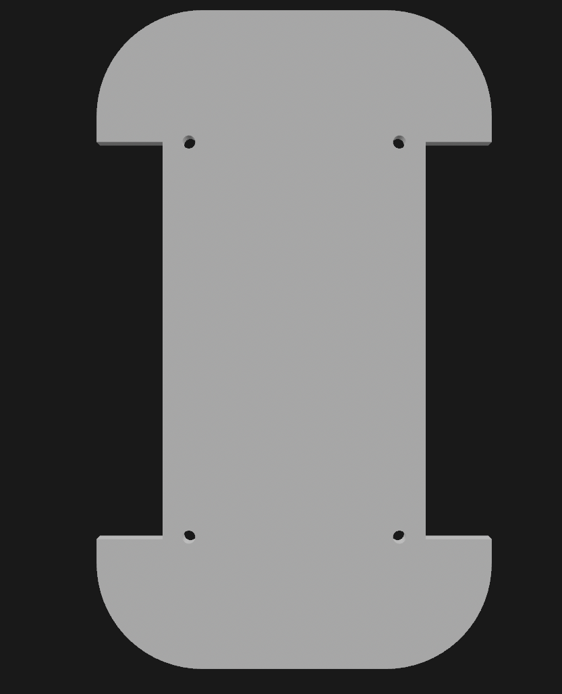
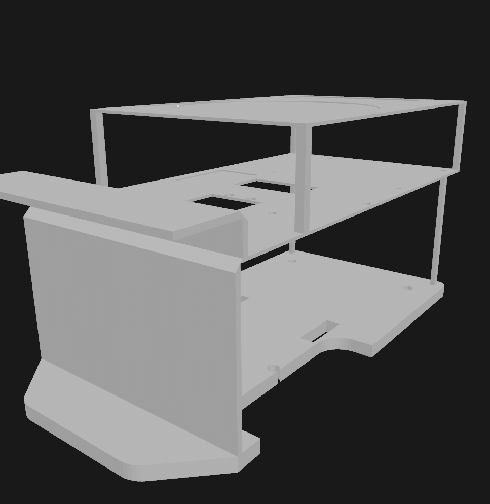
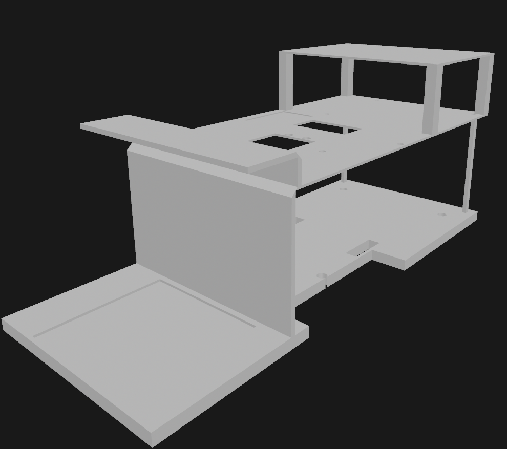

🤖 WRO FE Robot Evolution — V1 vs V2 vs V3
🧩 Overview

This document compares the three generations of our WRO Future Engineers robot, focusing on structural design, sensor integration, and competition-oriented optimization.

The evolution reflects a clear shift from a basic prototype (V1) → high-performance system (V2) → fully optimized competition robot (V3).

🖼️ Design Snapshots
### V1

V2 — Advanced Model (RPLidar A3)

V3 — Final Competition Model (RPLidar C1)

⚙️ Design Philosophy Shift

The progression across versions is not just incremental — it reflects a refinement of engineering priorities:

V1: Built to test basic movement and functionality
V2: Focused on maximizing sensing capability (high-end LiDAR)
V3: Designed specifically for competition efficiency and reliability
🏗️ Structural Comparison
1. Base Geometry
V1: Flat, simple plate with minimal shaping
V2: Larger multi-layer structure with added complexity
V3: Refined geometry with smoother edges and optimized cutouts

➡️ Impact:
Improved weight distribution and reduced unnecessary mass → better motion efficiency

2. Layering System
V1: Single-layer design
V2: Multi-layer but dense and bulky
V3: Clean, intentional multi-layer architecture

➡️ Impact:

Better separation of components
Easier access for debugging
Improved airflow and cable routing
3. Mounting & Hole Placement
V1: Minimal and less structured
V2: Expanded but not fully optimized
V3: Symmetrical, purpose-driven layout

➡️ Impact:

Faster assembly
Higher precision alignment
Better modular compatibility
4. Component Integration
V1: Components placed based on available space
V2: Dedicated mounts but crowded layout
V3: Clearly defined zones for each subsystem

➡️ Impact:

Balanced center of mass
Improved stability during turns
Cleaner and more professional system layout
5. Expandability
V1: Very limited
V2: Expandable but constrained by weight and space
V3: Designed with open structure and vertical clearance

➡️ Impact:

Easy integration of new sensors
Future-proof architecture
Faster iteration cycles
⚙️ Sensor System Evolution
V2 → V3 Key Upgrade
Feature	V2 (RPLidar A3)	V3 (RPLidar C1)
Range	~25m	~12m
Data Density	Very High	Moderate
Processing Load	High	Lower
Weight	Heavy	Lighter
Suitability (WRO)	Overkill	Optimized

➡️ Impact:

V2 prioritized maximum sensing capability
V3 prioritizes faster decision-making and efficiency
🚀 Performance-Oriented Improvements
Feature	V1	V2	V3 (Latest)
Stability	Basic	Improved	Highly optimized
Weight Efficiency	Moderate	Low (heavy)	High
Sensor Capability	Low	Very High	Optimized
Processing Speed	Fast	Slower (heavy load)	Faster (efficient)
Maintenance	Difficult	Moderate	Easy
Scalability	Low	Medium	High
🧠 Key Insight

The biggest improvement is not hardware — it is engineering focus.

V1 proves the concept
V2 explores maximum capability
V3 removes everything unnecessary and keeps only what wins

The shift from RPLidar A3 → C1 is a perfect example:

Not a downgrade — a deliberate optimization for real competition constraints.

🔧 What This Enables
Faster and more reliable navigation
Stable turning using better weight balance
Efficient LiDAR-based obstacle detection
Seamless integration with ESP32 + Raspberry Pi hybrid system
Better performance under repeated WRO runs
📌 Final Takeaway

V1 made the robot move.
V2 made the robot powerful.
V3 makes the robot competition-ready.
