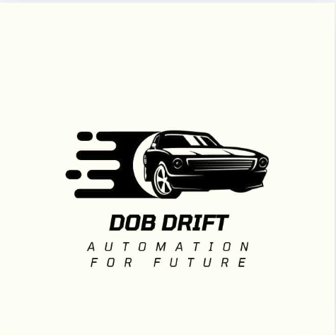

# 🤖 DOB Drift — WRO Future Engineers Robot

---

## 🚀 Team Overview

DOB Drift is a robotics team from Bangladesh competing in the **World Robot Olympiad (WRO) Future Engineers Category**.

We focus on building a high-performance autonomous robot that integrates real-time perception, embedded control, and intelligent decision-making.

---

### 🎯 Our Robot Goals

- Precision navigation  
- Sensor fusion-based localization  
- Autonomous obstacle handling  
- Competition-grade reliability  

---

## 🤖 Robot Overview

Our robot is built for **WRO Future Engineers 2026**, capable of:

- 🏁 Completing autonomous laps  
- 🚧 Detecting and avoiding obstacles  
- 🎯 Performing precise parking  
- 🧭 Real-time localization using sensor fusion  

---

### ⚙️ Core System

We combine:

- Raspberry Pi (high-level AI + processing)  
- ESP32 (real-time motor & sensor control)  
- LiDAR + Camera + IMU + Encoders  

---

## 🧠 Key Features

- 📡 RPLidar-based 360° scanning  
- 🎥 Camera-based object & color detection  
- 🔁 Encoder-driven odometry system  
- 🧭 BN0086 IMU stabilization  
- ⚙️ Hybrid control system (Pi + ESP32)  
- 🚗 Differential drive + servo steering  
- 🔋 Dual power regulation system  
- 🧩 Modular, competition-optimized architecture  

---

## 🔩 Components

- Webcam  
- RPLidar  
- Raspberry Pi  
- ESP32  
- UBEC 5V  
- LM2596 Voltage Regulator  
- Encoder Motor System  
- BN0086 IMU  
- TB6612FNG Motor Driver  
- Servo Motors  

---

## 🏁 Mission Overview (WRO FE)

### 🏁 Round 1 — Lap Completion

- Complete 3 autonomous laps  
- Stable navigation  
- Accurate lap counting  

---

### 🏆 Round 2 — Obstacle + Parking

- 3 laps with obstacle avoidance  
- 🟢 Green → move left  
- 🔴 Red → move right  
- Final precise parking  

---

## 📁 Repository Structure

DOB-Drift/
│
├── assets/        # Images & visuals
├── models/        # CAD & 3D designs
├── src/           # Robot source code
├── instructions/  # Setup guides
├── t-photos/      # Technical images
├── v-photos/      # Showcase images
├── video/         # Demo videos

---

## ⚙️ System Architecture

### 🧠 Sensor Fusion
Encoder + IMU + LiDAR  

---

### 🎯 Decision System
Rule-based state machine  

---

### 🎥 Vision System
Color-based object detection  

---

### ⚡ Control System
- ESP32 (low-level control)  
- Raspberry Pi (high-level planning)  

---

## 🚗 Mobility System

### Differential Drive
- Smooth turning  
- Encoder-based tracking  
- Stable motion control  

---

### Servo Steering (Ackermann-inspired)
- Precision directional control  
- Supports camera/LiDAR positioning  
- Hybrid LEGO + servo mechanism  

---

## 🔋 Power System

- 🔋 3S LiPo Battery  

### ⚡ Dual Buck Converter System
- Raspberry Pi + sensors → stable rail  
- Servos + peripherals → high-current rail  

---

### 🔇 Benefit
Improved noise isolation → better sensor accuracy  

---

## 👥 Team Members

### 🧑‍💻 Md Ayaan Rahman  
Embedded Systems & Robotics  
DOB Drift — WRO Future Engineers  

---

### 🧑‍💻 Shreyan Chakroborty  
Software, Control Systems & AI  
DOB Drift — WRO Future Engineers  

---

## 🌐 Connect With Us

- 📘 Facebook  
- 💼 LinkedIn  
- ▶️ YouTube  

---

## 📌 Important

📖 **WRO Future Engineers Rulebook 2026**  
Always follow official competition guidelines during development and testing.

---

## 🧠 Final Note

DOB Drift is continuously evolving its robot with focus on:

- Higher precision  
- Faster decision-making  
- Stronger robustness under competition conditions  
