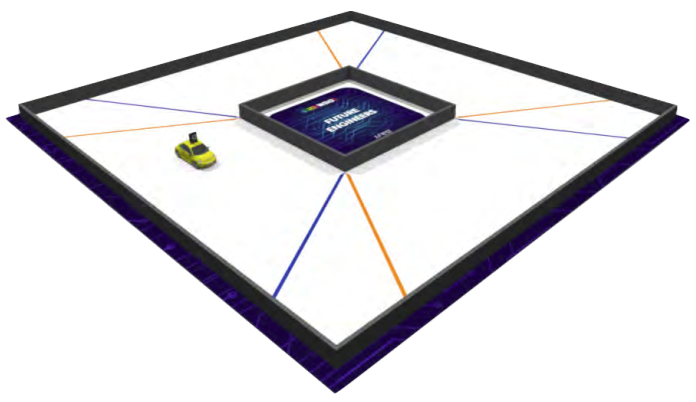
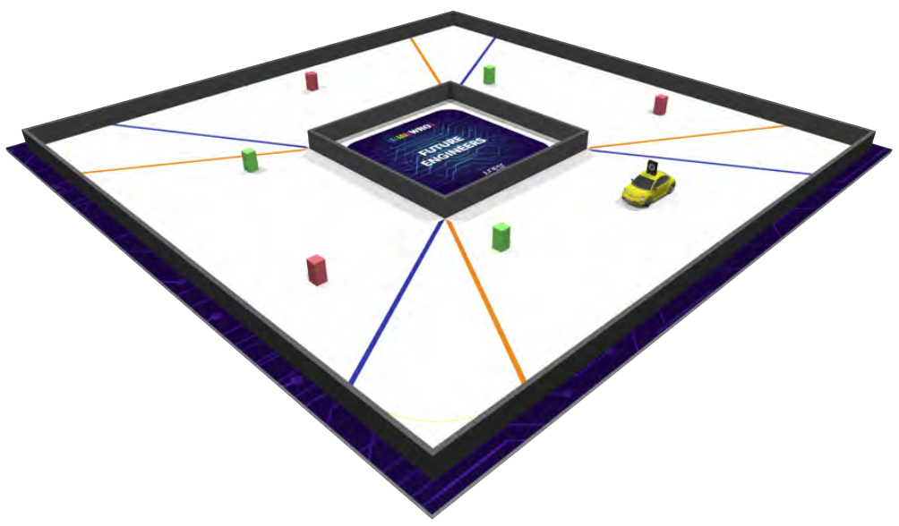

# 🤖 WRO Future Engineers — Rules, Rounds & Track Guide

## 🧭 Overview

**WRO Future Engineers** is a self-driving car competition under the World Robot Olympiad (WRO). Teams design fully autonomous vehicles that can navigate a track, detect obstacles, and complete laps without human intervention.

The challenge is divided into **two main rounds**, each testing different aspects of autonomy, reliability, and engineering design.

---

## 🛣️ The Track

### 🟦 Round 1 Track (Open Challenge)

### 🟥 Round 2 Track (Obstacle Challenge)

---

## ⚙️ General Rules (Apply to Both Rounds)

* The robot must be **fully autonomous** (no remote control).
* Only **one start command** is allowed.
* The robot must complete **multiple laps** (usually 3).
* Teams must use a **self-built robot** (no pre-built kits).
* Size and safety constraints must be followed.
* Sensors (LiDAR, camera, ultrasonic, IMU, etc.) are allowed.

---

## 🟦 Round 1 — Open Track (Consistency & Control)

### 🎯 Objective

Complete the track by following the path and making smooth turns.

### 🔑 Key Rules

* No obstacles on the track
* Focus on **lane following / wall following**
* Must complete laps without crashing
* Time + consistency matters

### 🧠 What It Tests

* Basic autonomous navigation
* Steering control (servo precision)
* Stability and repeatability

---

## 🟥 Round 2 — Obstacle Challenge (Decision Making)

### 🎯 Objective

Navigate the same track **with obstacles placed randomly**.

### 🔑 Key Rules

* Obstacles can appear on left or right
* Robot must **detect and avoid obstacles**
* Must decide when to go left or right
* No human intervention allowed

### 🧠 What It Tests

* Sensor fusion (LiDAR, vision, etc.)
* Real-time decision making
* Adaptive algorithms

---

## ⚔️ Round Comparison

| Feature          | Round 1 (Open)    | Round 2 (Obstacle)      |
| ---------------- | ----------------- | ----------------------- |
| Track Complexity | Simple            | Complex                 |
| Obstacles        | ❌ None            | ✅ Random                |
| Main Focus       | Stability         | Intelligence            |
| Navigation       | Pre-defined logic | Dynamic decision making |
| Difficulty       | Medium            | High                    |
| Key Skill        | Control           | Perception + AI         |

---

## 🧠 Strategy Insights

### For Round 1

* Use simple but reliable algorithms
* Focus on **smooth steering and calibration**
* Minimize drift and overcorrection

---

### For Round 2

* Use **LiDAR or camera-based detection**
* Divide environment into **left / front / right zones**
* Implement decision logic:

  * If obstacle left → go right
  * If obstacle right → go left

---

## 🚀 Engineering Tips

* Keep **center of mass low** for stability
* Ensure **sensor placement is optimal** (height + angle matters)
* Use **modular design** for quick fixes
* Test in **different lighting and conditions**

---

## 📌 Final Takeaway

* **Round 1 wins consistency**
* **Round 2 wins intelligence**

To succeed in WRO Future Engineers, your robot must master both.

It’s not just about building a robot —
it’s about building a system that can **think, adapt, and perform under uncertainty**.

---

